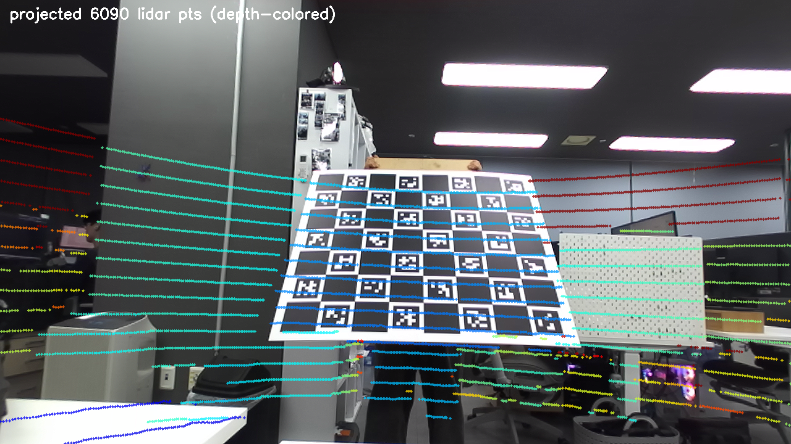
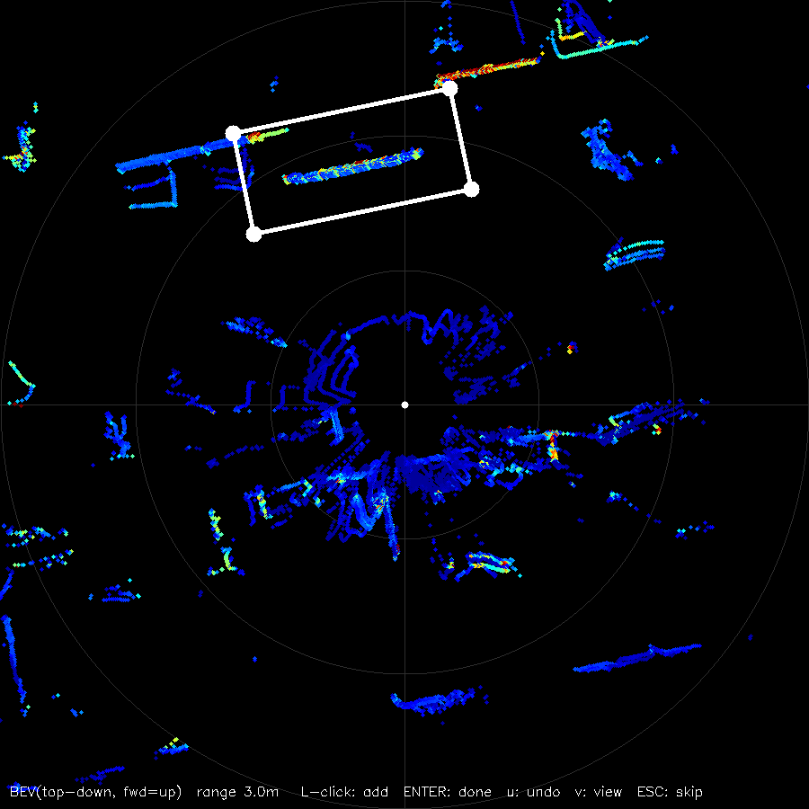

# Stereo-LiDAR-Calibration

**RoboSense RS-16 LiDAR ↔ ZED stereo camera extrinsic calibration** for Formula Student
Driverless, built as a ROS 2 Humble workspace. ChArUco-board, **plane-based** solver
designed around the RS-16's narrow (±15°) vertical FOV, with a one-command workflow
optimized for rigs whose sensors are frequently detached and remounted.


*Solved extrinsic verified by lidar→image projection (depth-colored rings on the tilted board).*

## Why plane-based?

At close range the RS-16 sees only a `2·d·tan15°`-tall band of the board, so the board
corners are often **not observable**. The solver therefore uses, per pose:

1. **Camera**: ChArUco → metric board plane (mono PnP, or **stereo triangulation** with a
   rig-wide disparity-offset estimate that absorbs aged-rectification toe-in)
2. **LiDAR**: ROI → RANSAC plane → known-size rectangle fit (+ FOV-clipping detection)
3. Multi-pose solve: normal-Kabsch rotation → point-to-plane least-squares translation →
   joint nonlinear refine (corner residuals noise-balanced at w=0.05)

Observability is reported explicitly: `translation conditioning` and `rotation normal
spread` both print GOOD/WEAK so a bad pose set cannot silently produce a wrong extrinsic.
Validated on synthetic ground truth (0.12°, 0.04 mm recovery).

## Hardware / prerequisites

- ROS 2 Humble (tested on Jetson AGX Orin, JetPack/L4T)
- ZED SDK + [`zed-ros2-wrapper`](https://github.com/stereolabs/zed-ros2-wrapper)
- [`rslidar_sdk`](https://github.com/RoboSense-LiDAR/rslidar_sdk) (RS-16)
- 8×7 ChArUco board, square 0.12 m, DICT_5X5_50 (edit `src/charuco_lidar_calib/config/calib.yaml` for yours)
- python3: numpy, scipy, opencv (cv_bridge)

## Install & build

```bash
git clone https://github.com/shdragron/Stereo-LiDAR-Calibration.git ros2_ws
cd ros2_ws/src
git clone --recurse-submodules https://github.com/RoboSense-LiDAR/rslidar_sdk.git
git clone --recurse-submodules https://github.com/stereolabs/zed-ros2-wrapper.git
cd .. && colcon build && source install/setup.bash
```

Set your camera intrinsics fallback and board spec in `src/charuco_lidar_calib/config/calib.yaml`
(the workflow grabs live intrinsics anyway; the fallback is guarded by a loud warning).

## Workflow (one command each)

| script | usage | role |
|---|---|---|
| `./launch.sh [race\|calib]` | default `race` | sensor bringup. race = publish extrinsic TF, calib = sensors only |
| `./capture.sh` | | capture GUI: **SPACE** = save synced pair → draw lidar ROI (top-down BEV, intensity-colored, zoom), **Q** = quit |
| `./calib.sh [session]` | default latest | grab intrinsics → solve (headless, uses capture-time ROIs) → archive history + per-session `extrinsic.yaml` |
| `./tf_change.sh [session\|yaml]` | default current | swap the active extrinsic and live-replace the TF publisher |
| `./projection.sh [images…]` | default latest | project the same-named pcd onto the image → `calib_debug/fusion_*.png` + viewer |
| `ros2 run fsg_sensors preflight` | `--no-tf` during calib | pre-run health check: power mode, clock lock, rates, latency, lidar-camera pairing, TF → PASS/FAIL |


*Capture-time ROI: right after SPACE, lasso the board (the short bright line segment ahead)
in the top-down intensity-colored BEV. Rough is fine — the ROI only hands RANSAC an
unambiguous region; a range slider zooms, `v` toggles a camera-like front view.*

### Remount procedure (the whole point)

```
./launch.sh calib → ./capture.sh   # 6–10 board poses, varied yaw/pitch tilt, 2–2.5 m
→ ./calib.sh                       # solve; check t_condition & rot_spread = GOOD
→ ./projection.sh                  # eyeball the overlay
→ ./tf_change.sh && ./launch.sh    # apply
```

Pass criteria: plane RMSE < 10 mm · both observability metrics GOOD · overlay aligned.

## Public topic contract (identical in race and calib mode)

```
/sensors/lidar/points               PointCloud2 (frame rslidar, 10 Hz, per-point ring+timestamp)
/sensors/camera/left/compressed     CompressedImage (JPEG, 30 Hz, lazy — zero cost unsubscribed)
/sensors/camera/left/info           CameraInfo
/sensors/camera/right/compressed
/sensors/camera/right/info
```

The vendor ZED wrapper runs unmodified under a hidden namespace (`/_zed_hidden/...`);
a lazy relay exposes only the topics above. Raw images remain subscribable on the hidden
names for the calibration tools.

### Timestamp caveat (measured, matters for driving fusion)

The ZED `header.stamp` is the frame-in-PC-memory time, **not** exposure time — exposure
precedes it by ~1–2 frame periods (SDK-documented, uncompensated but ~constant). LiDAR
stamps are near-physical. For moving-vehicle fusion, identify the camera offset once
(LED/motion test) and fold it into per-point-timestamp deskew.

## Repository layout

```
src/charuco_lidar_calib/   calibration package (capture-time ROI, plane-based solver, verify)
src/fsg_sensors/           bringup: launch, relay, preflight, extrinsic history
*.sh, sync_capture.py      workflow scripts (portable — resolve the workspace from their own path)
docs/                      2026-07 bring-up report (Korean) + example images
```

Outputs (`calib_debug/`, `captures/`) are git-ignored; each capture session keeps its own
`extrinsic.yaml` so `./tf_change.sh <session>` can restore any past calibration.
